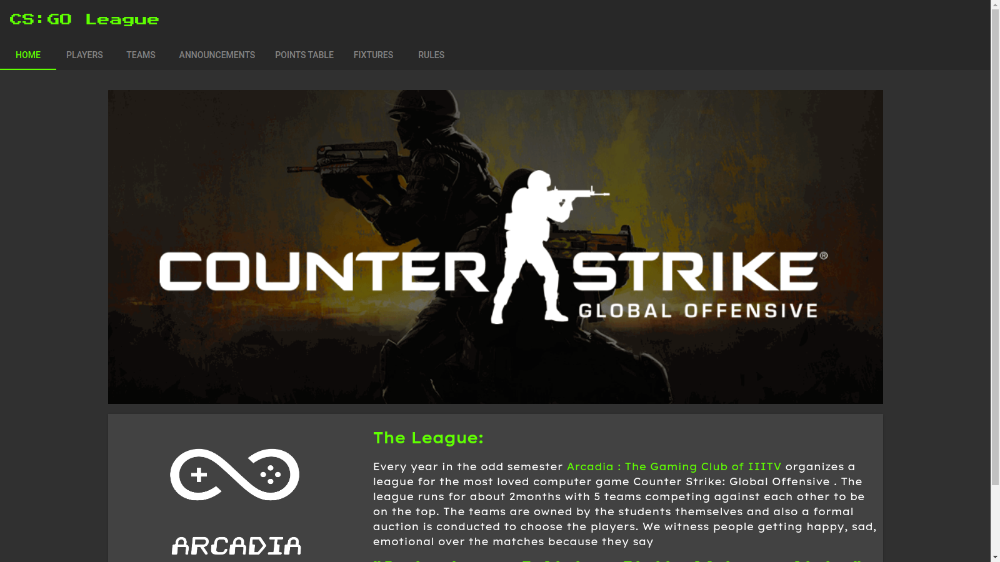
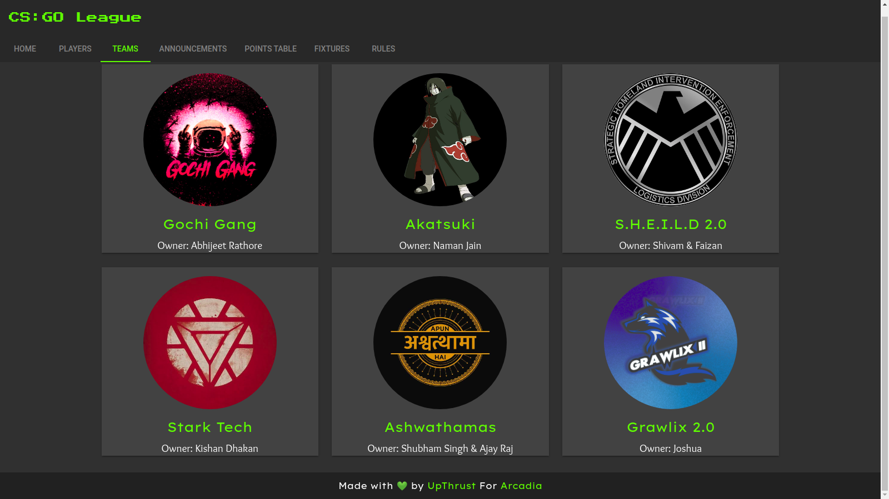
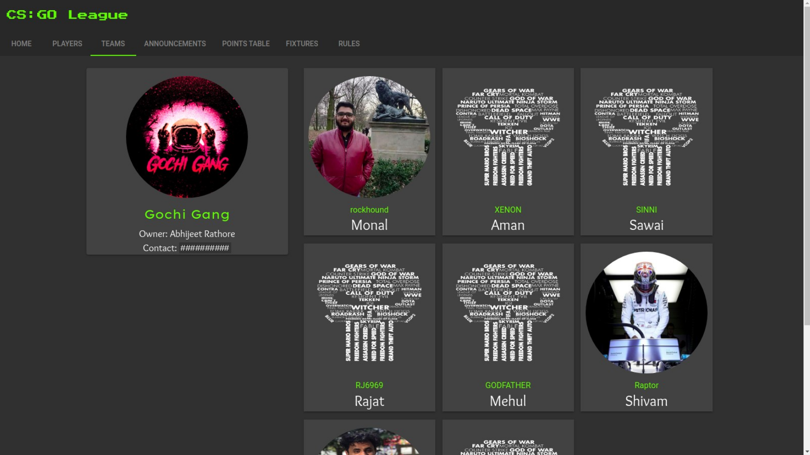
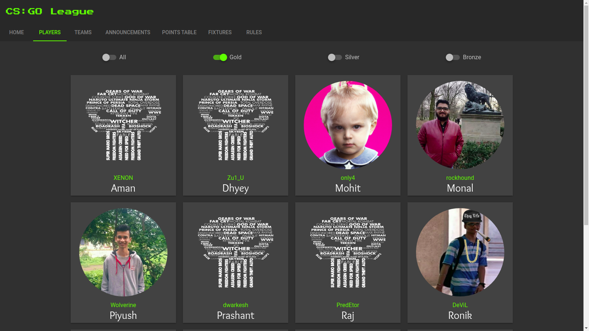
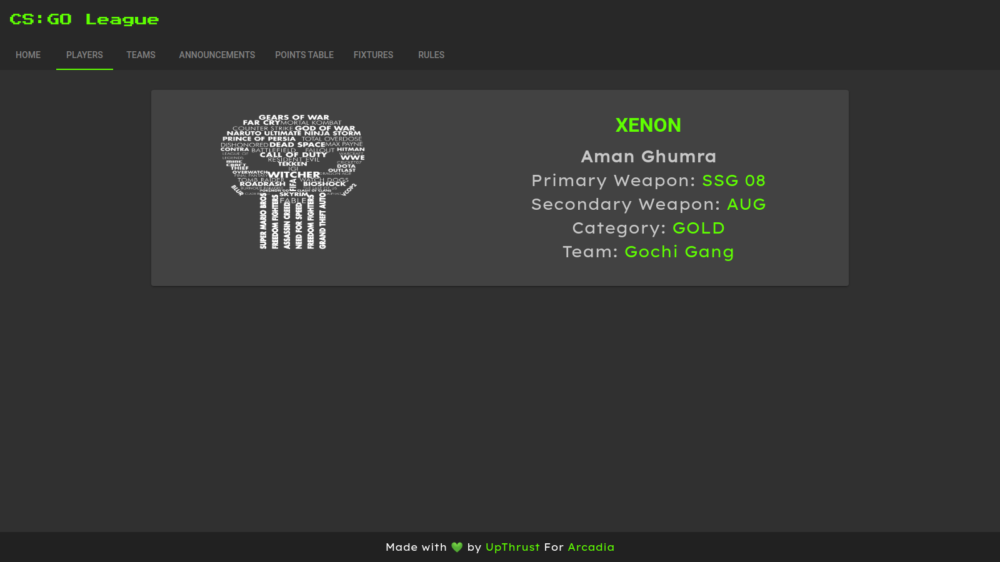
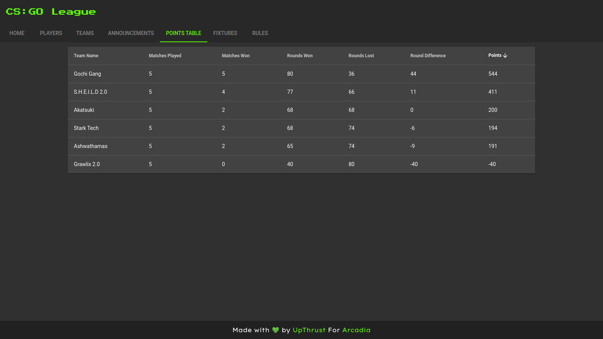
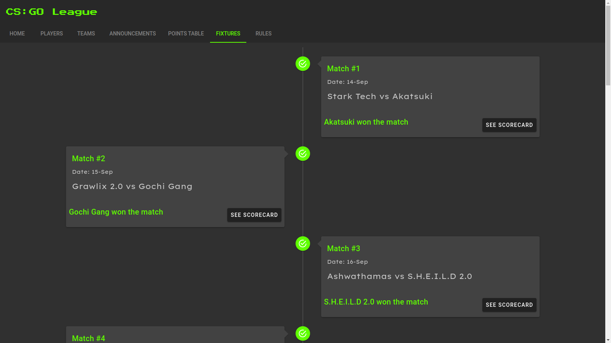

<!-- PROJECT LOGO -->
<br />
<p align="center">
  <a href="https://github.com/othneildrew/Best-README-Template">
    
  </a>

  <h3 align="center">CS : GO League Web App</h3>

  <p align="center">
    A website for CS:GO league organised by Arcadia: The Gaming Club of IIITV
    <br />
    <a href="https://csgo-auction.web.app/"><strong>See the DEMO »</strong></a>
    <br />
    <br />
  </p>
</p>

## About

[](https://csgo-auction.web.app/)

This Web Application is built for the CS: GO League organized by ARCADIA -The Gaming Club of IIIT Vadodara. Every year, in the odd semester Arcadia organizes a league for the most loved PC Game - Counter-Strike: Global Offensive. In this league, some students own team and an auction is organized to choose players. 

## Features

- See the list of registered players and their profile. 
- See which team has which player.
- Announcements such as, player sold to which team and which team won the match.
- All the fixtures and their result with scorecard.
- Points table and current standing.
- Rules of the league

## Showcase

|       List of Teams      |         Team Profile        |
| :----------------------: | :-------------------------: |
|  |  |

|       List of Players      |        Player Profile      |
| :------------------------: | :------------------------: |
|  |  |

|      Points Table     |        Fixtures        |
| :-------------------: | :--------------------: |
|  |  |


## Project setup

- Install the NPM packages
```
npm install
```

- Build and run the project
```
npm run serve
```

---

## Developers

- [Ravi Varshney](https://github.com/ravivarshney01)
- [Ananya Tewari](https://github.com/antew7)
- [Vishal Gaur](https://github.com/i-vishi)


## Built with 

- [Vue.js](https://vuejs.org/) - An open-source model–view–viewmodel front end JavaScript framework for building user interfaces and single-page applications.
- [Firebase](https://firebase.google.com/) - for NoSQL database and hosting the web application.
- [Vuetify](https://vuetifyjs.com/) - Vue UI Library with beautifully handcrafted Material Components.

---

<p align="center"> Made with ❤️ by <a href="https://github.com/var-dev">VAR Solutions</a></p>
